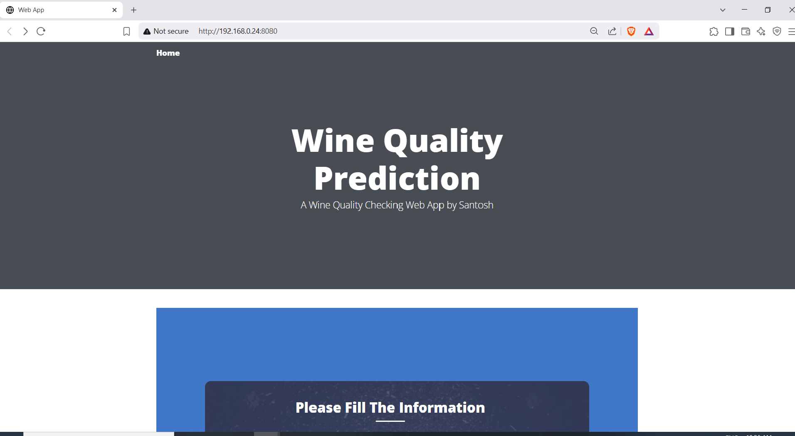
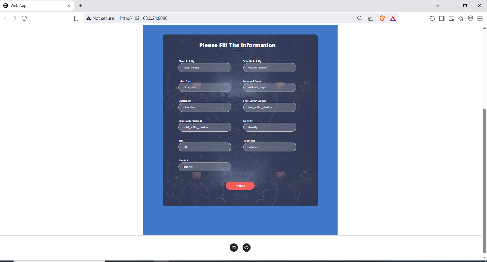
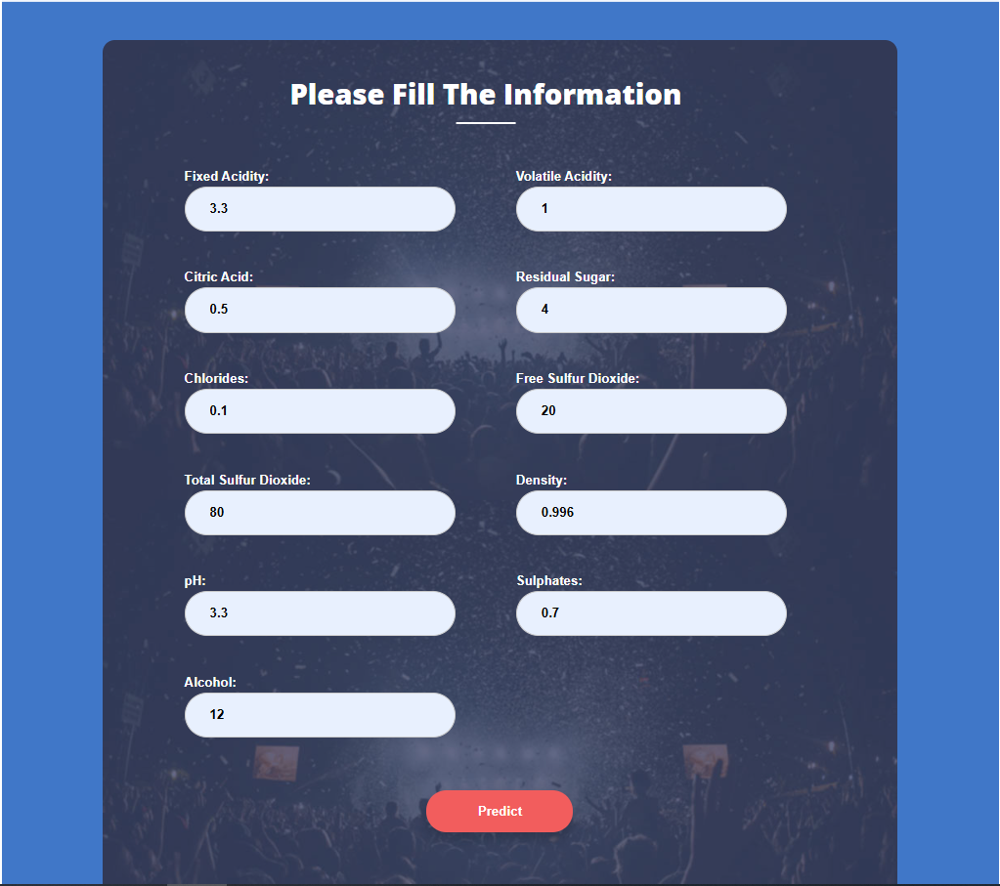
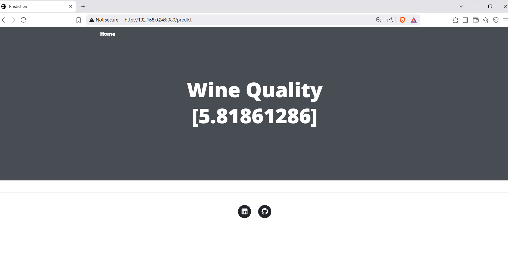

# 🍷 Red Wine Quality Prediction

This repository presents a complete **end-to-end machine learning project** aimed at analyzing and predicting the quality of red wine using various regression techniques. From exploratory data analysis to production-ready deployment on AWS via Docker and GitHub Actions, this project showcases a full MLOps pipeline.

---

## 📊 Project Overview

The goal is to understand the key factors that influence red wine quality and build an accurate predictive model. The project includes:

- Detailed Exploratory Data Analysis (EDA)
- Data preprocessing & feature engineering
- Model building using multiple regressors
- Hyperparameter tuning using `RandomizedSearchCV`
- Experiment tracking with **MLflow** via **DagsHub**
- End-to-End ML pipeline using modular Python components
- Flask-based Web App for prediction
- AWS deployment with Docker & GitHub Actions

---

## 📁 Dataset

- **Source**: [UCI Machine Learning Repository](https://archive.ics.uci.edu/ml/datasets/wine+quality)
- **Format**: CSV
- **Size**: 1,599 samples × 12 features
- **License**: Freely available for research purposes

---

## 🎯 Objectives

- Perform EDA to uncover insights and trends
- Handle missing values, scaling, and duplicates
- Train & evaluate various models (ElasticNet, RandomForest, CatBoost, etc.)
- Use MLflow for tracking experiments
- Optimize models with `RandomizedSearchCV`
- Deploy the best-performing model with Flask on AWS EC2

---

## 📌 Experiment Tracking (MLflow)

- **Track models & parameters**: [MLflow Experiments on DagsHub](https://dagshub.com/santoshkumarguntupalli/Red-Wine-Quality/experiments)

- **Compare Metrics & Parallel Coordinate Plot**:  
  [Model Comparison Dashboard](https://dagshub.com/santoshkumarguntupalli/Red-Wine-Quality/experiments#/compare?experiments=[%22m_8f6a9c5bf2d045ff9467f1dd5adaf598%22,%22m_d1c91b23278047398edb862aad285050%22,%22m_ab18db28a5f04ed5b95d44e4aaa6a356%22,%22m_1ef7b893c7f5488ca476c9ac961ee24d%22,%22m_84ecdef65f9f416cac8ff92c3fa928f5%22])

---

## 🧪 Model Results (Top 5)

| Model               | R2 Score | RMSE    | MAE     | Best Parameters |
|--------------------|----------|---------|---------|------------------|
| CatBoostRegressor  | **0.459**| 0.604   | 0.467   | depth=9, iter=171, lr=0.056 |
| Random Forest       | 0.440    | 0.615   | 0.470   | max_depth=13, estimators=252 |
| LGBMRegressor       | 0.433    | 0.618   | 0.485   | max_depth=3, lr=0.064 |
| XGBRegressor        | 0.425    | 0.623   | 0.483   | max_depth=3, lr=0.064 |
| Ridge Regression    | 0.403    | 0.635   | 0.489   | alpha=0.68 |

✅ **Best Model**: CatBoostRegressor

---

## 🧱 End-to-End Pipeline

The project follows a modular pipeline design with the following components:

```bash
📁 config/
   ├── config.yaml
   ├── params.yaml
   └── schema.yaml

📁 src/
   ├── config/
   ├── components/
   ├── pipeline/
   └── utils/

main.py       # Pipeline entry point
app.py        # Flask Web App
```

---

## 🚀 Deployment on AWS (CI/CD + Docker)

### ✅ Prerequisites

- AWS IAM user with:
  - AmazonEC2FullAccess
  - AmazonEC2ContainerRegistryFullAccess
- Docker installed on EC2
- GitHub repository secrets configured

### 🧭 Deployment Steps

1. **Build Docker Image**
2. **Push to ECR**  
   Repository: `741448950156.dkr.ecr.eu-west-2.amazonaws.com/red_wine_mlp`

3. **Launch EC2 Instance** (Ubuntu)  
   Install Docker & Pull image from ECR

4. **Configure GitHub Actions Runner**  
   GitHub > Settings > Actions > Runners > New Self-hosted Runner

5. **Set GitHub Secrets**

```env
AWS_ACCESS_KEY_ID=*******
AWS_SECRET_ACCESS_KEY=*******
AWS_REGION=eu-west-2
AWS_ECR_LOGIN_URI=741448950156.dkr.ecr.eu-west-2.amazonaws.com
ECR_REPOSITORY_NAME=red_wine_mlp
```

---

## 🌐 Flask Web App

An interactive Flask-based UI is included to predict wine quality based on physicochemical attributes.

### Run Locally

```bash
# Clone the repo
git clone https://github.com/santosh3110/Red-Wine-Quality.git
cd Red-Wine-Quality

# Create conda env
conda create -n myenv python=3.11 -y
conda activate myenv

# Install dependencies
pip install -r requirements.txt

# Run the app
python app.py
```

---

## 🖼️ Screenshots









---

## 📚 Tech Stack

- Python, Pandas, NumPy, Scikit-learn
- CatBoost, LightGBM, XGBoost
- Matplotlib, Seaborn
- MLflow, DagsHub
- Flask
- Docker, GitHub Actions, AWS (EC2, ECR)

---

## 🤝 Contributions

Feel free to fork, improve, and submit pull requests!

---

## 📬 Contact

**Santosh Kumar Guntupalli**  
[GitHub](https://github.com/santosh3110) | [LinkedIn](https://www.linkedin.com/in/santoshkumarguntupalli)

---

## ⭐ Don't forget to give this project a star if you found it helpful!
